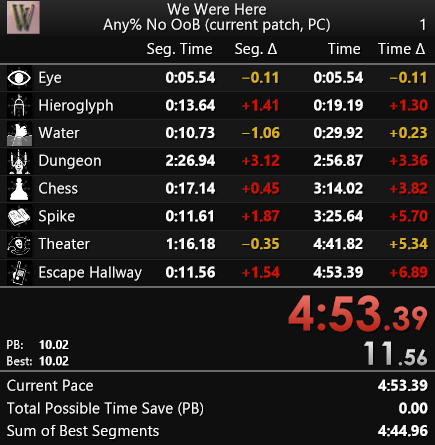
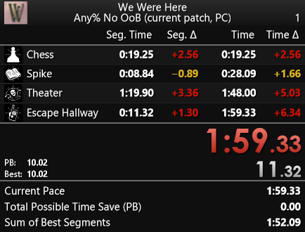
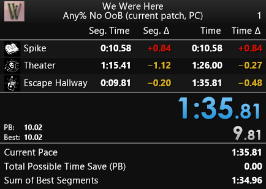

# We Were Here - Layouts

### **[LiveSplit](https://github.com/LiveSplit) layouts you can use.**

### Layouts components:
- Game and run category details.
- Splits details (Name, Segment Time, PB Segment Delta, Time, PB Time Delta).
- Run and Segment Timer.
- Predicted time.
- Possible time save.
- Sum of best segments.

### Layout previews:
<table style="margin-left: auto; margin-right: auto;">
  <tr>
    <th>
      Standard
    </td>
    <th>
      Start Chess
    </td>
    <th>
      Start Spike
    </td>
  </tr>
  <tr>
    <td>
      </img>
    </td>
    <td>
      </img>
    </td>
    <td>
      </img>
    </td>
  </tr>
</table>

### Compatibiliy:
- Works with the [autosplitter](https://github.com/Zeuba-Speedruns/AutoSplitters/tree/main/We%20Were%20Here) available in [LiveSplit](https://github.com/LiveSplit).
- Works with these [splits files](https://github.com/Zeuba-Speedruns/Splits/tree/main/We%20Were%20Here).

### Contact:
- If you have any issues, please ask on the ["We Were Here Speedrunning" Discord server](https://discord.gg/v9wcy5vz3x).